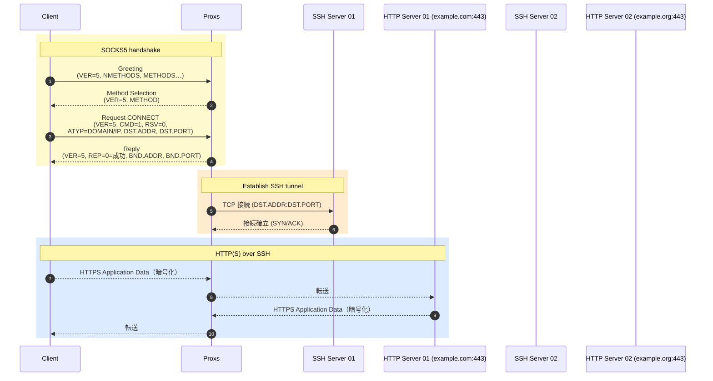

# Proxs

Proxs is a lightweight SOCKS5 proxy that forwards traffic through SSH tunnels.
It chooses a tunnel based on the destination address, allowing transparent access
to hosts behind multiple bastions.

## Building

```sh
go build
```

The resulting binary can then be executed directly.

## Configuration

Proxs reads a `config.toml` file from the user's configuration directory
(`$XDG_CONFIG_HOME/proxs` or on macOS `~/Library/Application Support/proxs`).
The file defines the listening port and one or more SSH proxies.

Example:

```toml
port = 8080

[proxy.env1]
hostname = "dev-instance-1.local"
user = "ubuntu"
port = 22
target_addrs = ["dev-instance-1.local"]
```

Each proxy entry includes:

- `hostname` – SSH host to dial.
- `user` – SSH user name.
- `port` – SSH port on the host.
- `target_addrs` – List of destination hostnames or glob patterns that should
  be routed through this proxy.

## Usage

Start the proxy:

```sh
./proxs
```

Configure your application to use `127.0.0.1:<port>` as a SOCKS5 proxy. When a
request matches one of the configured `target_addrs`, Proxs establishes an SSH
tunnel and forwards the connection.

## Diagram


