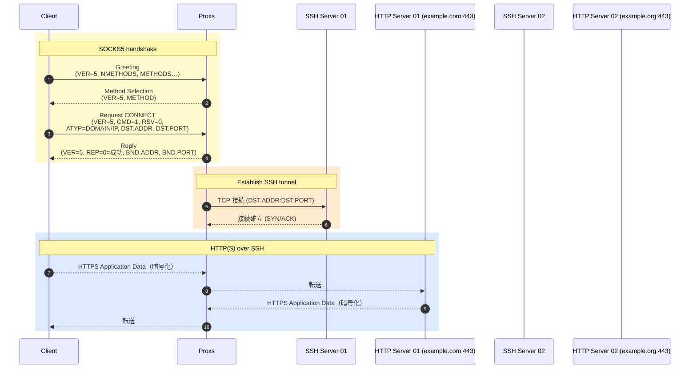

# Proxs

Proxs is a lightweight SOCKS5 proxy that forwards traffic through SSH tunnels.
It chooses a tunnel based on the destination address, allowing transparent access
to hosts behind multiple bastions.

This project was developed from a prototype presented in a talk at [生成 AI からセキュリティまで！数年ぶりのオフライン開催 Tech-Night イベントレポート - NTT docomo Business Engineers' Blog](https://engineers.ntt.com/entry/202509-tech-night-irl/entry#Socks-Proxy-%E3%81%8C%E3%81%A4%E3%82%89%E3%81%84).

## Building

```shell-session
$ make
```

The resulting binary can then be executed directly.

## Configuration

Proxs reads a `config.toml` file from the user's configuration directory
(`$XDG_CONFIG_HOME/proxs` or on macOS `~/Library/Application Support/proxs`).
The file defines the listening port and one or more SSH proxies.

Example:

```toml
port = 8080

[proxy.env1]
host = "prox-env1"
target_addrs = ["dev-instance-1.local"]
```

Each proxy entry includes:

- `host` – SSH host to dial. This should be defined in your SSH config (`~/.ssh/config`) with the necessary
  connection details (hostname, user, key, etc.).
- `target_addrs` – List of destination hostnames or glob patterns that should
  be routed through this proxy.

## Usage

Start the proxy:

```sh
./proxs
```

Configure your application to use `127.0.0.1:<port>` as a SOCKS5 proxy. When a
request matches one of the configured `target_addrs`, Proxs establishes an SSH
tunnel and forwards the connection.

## Diagram


```mermaid
sequenceDiagram
    autonumber
    participant C as Client
    participant PS as Proxs
    participant T1 as SSH Server 01
    participant S1 as HTTP Server 01 (example.com:443)
    participant T2 as SSH Server 02
    participant S2 as HTTP Server 02 (example.org:443)

    %% --------- SOCKS5 Handshake (plaintext) ---------
    rect rgb(255,250,205)
    Note over C,PS: SOCKS5 handshake

    C->>PS: Greeting<br/>(VER=5, NMETHODS, METHODS…)
    PS-->>C: Method Selection<br/>(VER=5, METHOD)

    %% opt 認証が必要な場合
    %%   C->>S: 認証要求（例: Username/Password）
    %%   S-->>C: 認証応答（成功/失敗）
    %% end

    C->>PS: Request CONNECT<br/>(VER=5, CMD=1, RSV=0,<br/>ATYP=DOMAIN/IP, DST.ADDR, DST.PORT)
    PS-->>C: Reply<br/>(VER=5, REP=0=成功, BND.ADDR, BND.PORT)

    end

    %% --------- Server connects to Target ---------
    rect rgb(255,235,205)
    Note over PS,T1: Establish SSH tunnel
    PS->>T1: TCP 接続 (DST.ADDR:DST.PORT)
    T1-->>PS: 接続確立 (SYN/ACK)
    end

    %% --------- TLS/HTTPS payload (encrypted) ---------
    rect rgb(220,235,255)
    Note over C,S1: HTTP(S) over SSH

    C-->>PS: HTTPS Application Data（暗号化）
    PS-->>S1: 転送
    S1-->>PS: HTTPS Application Data（暗号化）
    PS-->>C: 転送
    end
```

## License
This project is licensed under the MIT License. See the [LICENSE](LICENSE) file for details.