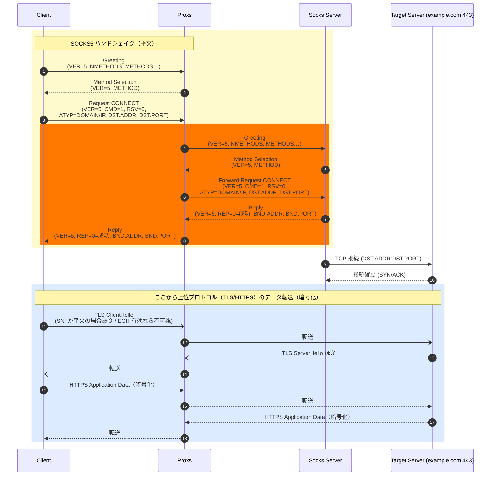

# Proxs

## Configuration
Proxs uses a configuration file named `config.toml` located in the user's configuration directory.
The default location is `~/Library/Application Support/proxs/config.toml` on macOS.

## Diagram
